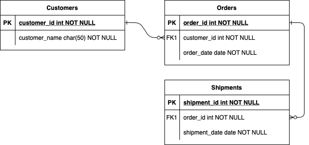

# GADZ

In order to follow all of the updates to this site, please visit [GADZWiki](https://github.com/dagreatcode/GADZ/wiki) and [Project Board](https://github.com/users/dagreatcode/projects/4)


## Table of Contents

- [Description](#description)
- [Features](#features)
- [WireFrame Diagram](#wireframe-diagram)
- [Database Diagram](#database-diagram)
- [To Dos](#to-dos)
- [Usage](#usage)
- [Tools](#tools)
- [Credits](#credits)
- [License](#license)
- [Badges](#badges)
- [Available Scripts](#available-scripts)
- [Developer Section](#developer-section)
- [Tests](#tests)
- [Installation](#installation)

---

## Description

### Project Board

[Project Board](https://github.com/users/dagreatcode/projects/4)

### Project Description

This is a Progressive Web App(PWA) built using React, TypeScript and Material
UI for frontend framework. The backend is based on NodeJS Express Server with PostgreSQL database.

[Old WebSite](http://globalassetdispatching.com/)

[FaceBook](https://www.facebook.com/global.asset.dispatching.service)

[Instagram](https://www.instagram.com/Global_assetleader/)

[Twitter](http://twitter.com/)

https://github.com/marmelab/react-admin

This app uses NodeJS and Express on the back end along with MongoDB as the database. The user interface was built using React.
bash install.sh
npm run dev
open localhost:8081 in browser

This project is a web application that allows truckers and shippers to interact with each other. The
application will have a user interface that allows the truckers and the shippers to view their accounts,
view their profiles, view their shipments, view their truckers, view their payments, and view their
shipments. The application will also have a system for the truckers and the shippers to log
in/out, reset their passwords, forgot their passwords, change their passwords, delete their accounts,
edit their accounts, and view their accounts. The application will also have a system for the truckers
and the shippers to view their shipments, view their truckers, view their payments, and view
their shipments. The application will also have a system for the truckers and the shippers to
view their shipments, view their truckers, view their payments, and view their shipments.

a short description explaining the what, why, and how.
What was your motivation?
Why did you build this project? (Note: The answer is not "Because it was a homework assignment.")
What problem does it solve?
What did you learn?
What makes your project stand out? If your project has a lot of features, consider adding a heading called "Features" and listing them here.

In order to follow all of the updates to this site, please visit [GADZWiki](https://github.com/dagreatcode/GADZ/wiki) and [Project Board](https://github.com/users/dagreatcode/projects/4)

---

### Project Status

The project is currently in development.

### Project Timeline

The project is expected to be completed in 6 months.

### Project Budget

The project is expected to cost $250,000.

### Project Team

The project team consists of 1 members.

### Project Technology Stack

The project will be built using React, Node.js, Express, and PostgreSQL.

### Project Requirements

The project requires the following features:

- User authentication and authorization
- User profile management
- Shipment management
- Trucker management
- Payment management
- Account management
- Forgot password feature
- Reset password feature
- Change password feature
- Delete account feature
- Edit account feature
- View account feature
- View shipment feature
- View trucker feature
- View payment feature
- View shipment feature
- View trucker feature

---

## Features

### User Authentication and Authorization

- User registration
- User login
- User logout
- User profile management
- User account management
- Forgot password feature
- Reset password feature
- Change password feature
- Delete account feature
- Edit account feature
- View account feature
- User role management
- User permission management
- User access control
- User authentication and authorization
- User session management
- User token management
- User password hashing and verification
- User password reset and recovery
- User account lockout and unlock
- User account deletion and recovery
- User account status management
- User account type management

Test Driven Error driven Data Driven...
Additional Features:

- Add User Authentication
- Implement CRUD operations on all tables in database
- Create an admin dashboard with basic stats about each table
- Allow user customization options (e.g., color scheme, font size etc.)

<!--     -->
## WireFrame Diagram
[Click here for Updated Wireframe](https://www.figma.com/file/7PcocRrzw7YuI8ZW5jeRt5/GADZ-Wireframe?type=design&node-id=0%3A1&mode=design&t=Zz7JU1VePBFylgey-1)


The wireframe diagram shows the main components of the application.
On the left side there are two menus that contain all the functionalities
of the app. On the right side you have the content area where different pages will be loaded depending on which menu item was clicked.
of the app. On the right side you have the content area where different pages will be loaded depending on which menu item was clicked
of the app. On the right side you have the content area where different pages will be loaded when an option from the menu is
of the app. On the right side you have the content area where different pages will be displayed.
Each page has its own URL which can be accessed directly from the browser address bar.

## Database Diagram



If you're new to Markdown, read the GitHub guide on [Mastering Markdown](https://guides.github.com/features/mastering-markdown/).

If you need an example of a good README, check out [the VSCode repository](https://github.com/microsoft/vscode).

---

## To Dos

Test Driven Error driven Data Driven...

    [X] Deploy and deploy often.
    [X] Set test for front and backend of the project.
    [ ] Make db rules
    [X] Create diagram.io
    [X] Make github rules
    [ ] CI/CD with cypress
    [ ] Server and Routes Test by Mocha & Chai
    [ ] Setup Redux
    [X] Wireframe
    [X] Features
    [X] Create Frontend trailed by Jest testing..
    [ ] Set up Redis for caching data.
    [ ] Add Security to Database
    [X] Create Data in Database to load to LoadBoard
    [X] Connect forms to database
    [ ] GADZWiki,
    [ ] README.md, and
    [ ] Code Sweep.
    [X] Redis or IndexDB and LocalStorage
    [X] Mobile Responsive
    [X] Downloadable
    [ ] GADZDevWiki
    [ ] GADZWiki
    [ ] README.md
    [X] Logo
    [X] TypeScript - Mocha & Chai - Jest - OOP (class, constructors, prototype) - TDD - SQL
    [ ] Unwanted Code and Packages.
    [X] Deploy and deploy often.
    [ ] HTML & CSS Mastered
    [ ] Set test for front and backend of the project.
    [ ] Make db rules
    [X] Start/Create diagram.io
    [ ] Make github rules
    [ ] CI/CD with cypress
    [ ] Server and Routes Test by Mocha & Chai
    [ ] Setup Redux
    [X] Wireframe
    [X] Features
    [X] Create Frontend trailed by Jest testing..
    [ ] Set up Redis for caching data.
    [ ] Connect Backend to Database.
    [ ] Finish server routes and controllers.
    [ ] Integrate React into Project.

---

## Usage

javascripts folder contains all javascript files that will be used on client side.
stylesheets folder contains all css styles.
public folder is where static assets are kept (images, videos etc.)
views folder is where html templates are stored.  
controllers contain logic connected to routing.
models contain database schema and methods related to it.

Inside views you can use ejs syntax <% %> to insert variables from your controller or model.

To start a new feature create a new file inside features directory. Name should describe what this feature does. Include at least one screenshot ifYou can also include other .ejs files using
To start development create a new file inside views folder and add .ejs extension to it. Then go to http://localhost:808To include a style sheet simply add <link relTo include a file just write <%- include>For example if you have a variable called "nameTo include a style sheet simply add <link rel
To start creating a new page, simply add a .html file into views folder. Then inside of that file write HTML code as usual. After
To start developing, open app.js in controllers folder. This is entry point for server side application.

javascripts/app.js - is a main js file which initializes our app. It uses require.js to load other scripts asynchronously.
javascripts/app.js - connects Vue to our Express server. It also sets up Vue Router which handles routes.

server.js - main server file. Contains express setup and middleware functions. Includes body parser and method override which helps us
server.js - main server file. Contains setup for express server and connection with MongoDB database.

package.json - list of dependencies needed by the project. You can add new packages there using npm i <name>.

.eslintrc.json - configuration file for ESLint. It's a tool for checking code quality and enforcing coding standards. More about ESLint can be found
.eslintrc.json - configuration file for ESLint tool. It helps keep code clean and follows best practices.

.prettierrc.json - configuration file for Prettier tool. It formats code according to agreed standards.

.markdownlint.json - configuration file for Markdown linter. It checks if markdown files follow agreed standards.

### Folder Structure

javascripts/app.js - is a main js file which initializes our app. It uses require.js to load other scripts asynchronously.

server.js - main server file. Contains express setup and middleware functions. Includes body parser and method override which helps us

package.json - list of dependencies needed by the project. You can add new packages there using npm i <name>.

.eslintrc.json - configuration file for ESLint tool. It helps keep code clean and follows best practices.

.prettierrc.json - configuration file for Prettier tool. It formats code according to agreed standards.

.markdownlint.json - configuration file for Markdown linter. It checks if markdown files follow agreed standards.

To start working on a feature create a new branch based off master. When done commit changes and make a pull request. If everything looks good merge
To start working on a feature create new file inside features directory and add reference to it in README.md

When adding new dependencies make sure they have license compatible with our company policy. If not contact legal department.
When you finish creating a feature make a pull request so I can merge it into master branch.

If there's an error please describe what exactly went wrong and how did you fix it.<br/> If possible provide screenshots or gifs<br/>
If there's an error please provide as much information about this issue as possible - what were you doing when the error occurred, which part of
<br/>If there's an error please describe what exactly went wrong and how you fixed it. If possible provide code examples.
<br/>If we are working on this project together with (Solutions Architect) Mr. Vincent Kendrick, clone this project and ask for access.
<br/>If you are working on this on your own, fork this project and continue to the next steps.

#### Please see examples and screenshots below.

Folder
|
|-- app.js

|-- controllers

| |-- server.js

| |-- userController.js
etc...

---

## Tools

Software Name: GADZConnect Created

Programming Language: JavaScript used on the Frontend and Backend of the project.

Frontend JS Library (Client Facing): React.JS [The View/ UX/UI/ Design]

Server Side JS Runtime environment Language: Node.js [ The Algorithms/Code]

Cloud/DevOps{

Development: render.com Free Tier (Take 30 Sec to spin up when sleep)

Production: Oracle Cloud Infrastructure Always Free Tier (1 Sec to spin up when sleep)

}

## Small Tools
CI/CD: GitHut Actions

Monitoring: New Relic

Logging: Splunk

Security: OWASP, Redhat

Testing: Jest Mocha Chia

Code Review: GitHub Code Review

Code Analysis: SonarQube

Code Formatting: Prettier

Code Linting: ESLint

ContactUs Page: nodeMailer

Upload Image: Multer

Save Image: Cloudinary
ORM: sequelize

Graphs: react-signature-canvas

Icons: lordicon

Database: postgreSQL - Future Oracle Cloud SQL

[Used to Navigate from page to page. React Router](https://reactrouter.com/core/guides/quickstart)

Oracle is the Cloud we are choosing for the future.

React Client view TypeScript ReactTypes

Bootstrap for CSS Frontend look.

Express RESTful API Routes/handlebars-Node Server Side 

TypeScript Sequelize 

planetscale.com SQL MySQL TimeScale n CockRoachDB Cloud

PostgreSQL

Clerk.com User Auth JWT Bcrypt

Cloudanry.com Uploaded images and files

Redis caching

[Redux State Management react-thunk plugin](https://redux.js.org/tutorials/typescript-quick-start)

CI/CD GitHub Action Cypress Testing

Mocha&Chi Server Testing

Jest Client testing

Axios Front n Back

React-Router-Dom Client nav routes to pages

lint prittier

SEO

<br>

### Impotent Links.

[Our DB for Development](https://www.cockroachlabs.com/docs/stable/connect-to-the-database?filters=javascript&filters=sequelize&filters=linux)

[DB Overview](https://cockroachlabs.cloud/cluster/320f50d5-4817-4fcb-b79c-470fea12b02c/overview?cluster-type=serverless)

#### Login Page

When accessing the website without logging in, users will be redirected to the login page.
Upon successful login they will be taken to their dashboard page. If an error occurs during login (e.g., invalid credentials), the user
Upon successful login, users will see their name at the top right corner along with an option to logout.
If they click on "Logout", it will log them out and send them back to the login page.
Users must enter their email and password to access the system. If successful, they will be logged in and sent to the dashboard page.
Users must enter their email and password to access the system. If successful, they will be logged in and sent to the dashboard page.
Users must enter their username and password to access any other part of the site.

#### Dashboard Page

Once logged in, users will see the Users Homepage page as default. Click Available This page contains links to all available functionalities.

### Authentication & Authorization

To ensure security, users' usernames and passwords are hashed using bcrypt before being stored in the database.
To ensure security, users should not be able to access certain parts of the website without proper authentication
To log in, users need to provide their email address and password. If they have not registered yet,
they will be redirected to the registration page if they try to access any protected area without logging in first.
All users must log in before accessing any other part of the application. The login process involves entering username and password credentials. If successful, they will
To access certain parts of the app, users must first log in using their credentials.
Once authenticated, they gain access to the entire platform. However, not all features may be visible to them depending on their role. The
All users must log in before accessing any part of the platform. The login process involves providing username
To access certain parts of the app, users need to log in first. The login page has two options:
Google OAuth2 / Devise.
Users must authenticate using their Google account in order to access any part of the application.
Once logged in, users have full permissions to access all features.
To add additional user roles, you will need to modify the User model and its associated views.

### Deployment

Deployed using Heroku. The app runs on Ruby on Rails version 5.0.3 and uses PostgreSQL as the database.
It has been set up to automatically scale horizontally using Heroku's Cedar stack.
Additionally, it uses Redis for caching. This means that any time a page is loaded, the server checks
Additionally, it uses Amazon S3 for file storage. The application connects to an AWS RDS instance for database storage.
Additionally, it uses Amazon S3 for storage of files. The application is configured to use CloudFront for serving static content. This means that
Additionally, it uses Amazon S3 for file storage and CloudFront for content delivery.
Both services provide high availability and load balancing out of the box.

### Known Issues

There are no known issues with the current version of Asset Tracker. However, please note that it was developed during a short period of time
There are no known issues at present. However, please note that this project was developed primarily
for demonstration purposes and may not be suitable for production use without further development.

Please report any bugs/issues via GitHub. Pull requests are welcome!

## Credits

If you're new to Markdown, read the GitHub guide on [Mastering Markdown](https://guides.github.com/features/mastering-markdown/).

#### You can see the markdownlint settings in action at this link: [link]()

[link]: https://github.com/igorshubin/markdownlint#configuration "MarkdownLint"

If you need an example of a good README, check out [the VSCode repository](https://github.com/microsoft/vscode).

Made from scratch MERN Stack Web App.

https://choosealicense.com/appendix/
https://www.videosdk.live/blog/react-js-video-calling
https://www.metered.ca/docs/Video-Calls/JavaScript/Building-a-Group-Video%E2%80%93Calling-Application/
https://github.com/marmelab/react-admin
https://pimylifeup.com/raspberry-pi-postgresql/
https://medium.com/@datatec.studio/remote-access-postgresql-in-raspberry-pi-2c275731207f
https://www.cockroachlabs.com/docs/stable/connect-to-the-database?filters=javascript&filters=sequelize&filters=linux
https://cockroachlabs.cloud/cluster/320f50d5-4817-4fcb-b79c-470fea12b02c/overview?cluster-type=serverless

---

## License

https://choosealicense.com/appendix/

MIT License

Copyright (c) 2023 Vincent Kendrick

Permission is hereby granted, free of charge, to any person obtaining a copy
of this software and associated documentation files (the "Software"), to deal
in the Software without restriction, including without limitation the rights
to use, copy, modify, merge, publish, distribute, sublicense, and/or sell
copies of the Software, and to permit persons to whom the Software is
furnished to do so, subject to the following conditions:

The above copyright notice and this permission notice shall be included in all
copies or substantial portions of the Software.

THE SOFTWARE IS PROVIDED "AS IS", WITHOUT WARRANTY OF ANY KIND, EXPRESS OR
IMPLIED, INCLUDING BUT NOT LIMITED TO THE WARRANTIES OF MERCHANTABILITY,
FITNESS FOR A PARTICULAR PURPOSE AND NONINFRINGEMENT. IN NO EVENT SHALL THE
AUTHORS OR COPYRIGHT HOLDERS BE LIABLE FOR ANY CLAIM, DAMAGES OR OTHER
LIABILITY, WHETHER IN AN ACTION OF CONTRACT, TORT OR OTHERWISE, ARISING FROM,
OUT OF OR IN CONNECTION WITH THE SOFTWARE OR THE USE OR OTHER DEALINGS IN THE
SOFTWARE. [https://choosealicense.com/](https://choosealicense.com/)

---

🏆

## Badges


[](http://nodejs.org/)
[](https://reactjs.org/)
[](https://expressjs.com/)
[](http://expressjs.com/)
[](https://expressjs.com/)
[](https://expressjs.com/)
[](http://expressjs.com/)
[](https://expressjs.com/)
[](https://www.mongodb.com/)  
[](https://redux.js.org/)

Badges aren't _necessary_, per se, but they demonstrate street cred. Badges let other developers know that you know what you're doing. Check out the badges hosted by [shields.io](https://shields.io/). You may not understand what they all represent now, but you will in time.

shields.io is used here to create badges that indicate things like version number and build status.
markdownlint is used to ensure consistency across the readme file.

---

## Contributing

If you created an application or package and would like other developers to contribute it, you will want to add guidelines for how to do so. The [Contributor Covenant](https://www.contributor-covenant.org/) is an industry standard, but you can always write your own.

---

# Developer Section

## Tests

Run this command to test the frontend react CLIENT app with JEST.

```

npm run testClient

```

Run this command to test the backend server files/routes/algorithms/plugins with Mocha & Chai.

```

npm run test

```

---

## Installation

Create a .env file in the root of the project
add

```
DATABASE_URL="postgresql://<user>:<password>@<host>:<port>/<database>?sslmode=verify-full"
```

Open terminal in code editor and run

```
npm install
npm install -D
npm run build && npm run start
```

### Important Terminal Commands

```
npm run client exited with code 0
npx create-react-app pwa-react-typescript --template cra-template-pwa-typescript
sudo pkill -f node
npm install -g sequelize-cli
npm install sequelize
sequelize init:config & sequelize init:models
ERD Entity relational diagram
sudo su postgres
```

This project was bootstrapped with [Create React App](https://github.com/facebook/create-react-app).

```
npm run client exited with code 0
npx create-react-app pwa-react-typescript --template cra-template-pwa-typescript
sudo pkill -f node
npm install -g sequelize-cli
npm install sequelize
sequelize init:config & sequelize init:models
ERD Entity relational diagram
sudo su postgres
```

Important Commands to start the project locally

```
npm i
npm i -D
npm run build
npm start
ctrl + c to stop the server
nodemon (for continuous development)
touch .env.local
echo "REACT_APP_BASEURL=http://localhost:3001" >> ./.env.local
or
vi ./.env.local and add "REACT_APP_BASEURL=http://localhost:3001" :qw!
```

###### After installing these VS Code Extension, CHECK The db Folder!!!

Add VS Code Extension [Database Client](https://database-client.com/#/home) by Weijan. Pick the PostgreSQL extension.

Also Add VS Code Extension REST Client API

CHECK THE db FOLDER for the dbDiagram as well.

Create a .env file in the root of the project
add

```
DATABASE_URL="postgresql://<user>:<password>@<host>:<port>/<database>?sslmode=verify-full"
```

Open terminal in code editor and run

```
npm install
npm install -D
npm run build && npm run start
```

###### After installing these VS Code Extension, CHECK The db Folder!!!

Add VS Code Extension [Database Client](https://database-client.com/#/home) by Weijan. Pick the PostgreSQL extension.

Also Add VS Code Extension REST Client API

CHECK THE db FOLDER for the dbDiagram as well.

#### Available Scripts

In the project directory, you can run:

- `npm start` : Runs the app in the development mode.<br>
  Open [http://localhost:3000](http://localhost:3000) to view it in the browser.
  The page will reload if you make edits.<br>
  You will also see any lint errors in the console.

- `npm test` : Launches the test runner in the interactive watch mode.<br>
  See the section about [running tests](#running-tests) for more information.

- `npm run build` : Builds the app for production to the `build` folder.<br>
  It correctly bundles React in production mode and optimizes the build for the best performance.
  The build is minified and the filenames include the hashes.<br>
  Your app is ready to be deployed!

- `npm run eject` :
  **Note: this is a one-way operation. Once you `eject`, you can’t go back!**
  If you aren’t satisfied with the built-in config and you want to add custom configuration please use the `npm run eject` command
  There are many ways to deploy a react application but a popular option is to use [Heroku](https://www.heroku.com/)<br><br><br>

### `public/*`

Files in the `public/` directory are static files that will be served directly by Express server. They should not be imported through JavaScript. Any
Files in the `public/` directory are static files that will be served directly and not passed through the module system. Instead of using the `<script>`
Files in the public folder are static and will be served directly. A file named `index.html` must exist, as it serves as the
Files in the `public/` directory are static files that will be served. A file called `index.html` must exist, and you should
Files in the `public/` directory are served as static files.<br>
You can add images, fonts, or other file types to this folder, and they will be served as-is by the web server.<
You can tweak them, add new files in this directory, or delete files to remove them from the application.

### Learn More

You can learn more in the [Create React App documentation](https://facebook.github.io/create-react-app/docs/getting-started).<br>
To learn React, check out the [React documentation](https://reactjs.org/).<br>
To learn Express, check out the [Express documentation](http://expressjs.com/en/starter/installing.html).</s>

### Code Splitting

We use this, we will me movint to vite soon: [https://facebook.github.io/create-react-app/docs/code-splitting](https://facebook.github.io/create-react-app)

### Analyzing the Bundle Size

Analyzing the bundle size of your app using this tool will give you insight into which modules are making the bundles larger and find ways
Analyzing the bundle size of your application build with Create React App using the "analyze" script. To start analyzing the JavaScript bund
Analyzing the bundle size of your app is a great way to make sure you aren’t accidentally adding large modules and weighting down
Analyzing the bundle size of your application build with Create React App using the "analyze" script is a simple as running one command:
Analyzing the bundle size of your application with Webpack is described in detail [here](https://webpack.js.org/guides)<br>

Analyzing the bundle size of your application build with Create React App using the "analyze" script is a simple as running one command:
Analyzing the bundle size of your application with Webpack is described in detail [here](https://webpack.js.org/guides)<br>

Analyzing the bundle size of your app is a great way to make sure you aren’t accidentally adding large modules and weighting down
Analyzing the bundle size of your app is a great way to make sure you aren’t accidentally including too many modules and keeping the
Analyzing the bundle size of your app is a great way to make sure you aren’t accidentally adding large modules and weighting down
Analyzing the bundle size of your application is a good practice. <br>
For that, you can use the build optimization tool at [https://www.webpack-analyzer.com/](https://www.webpack-analyzer.com/)
<br>

For that, you can use the "analyze" script provided by Create React App:<br>

bash<br>

```
npm run analyze
```

###### Configure Redux and Intl

Inside src/index.tsx file import following modules at top:
typescript
javascript
Add store configuration inside the Provider component:

```
const store = createStore(rootReducer);
ReactDOM.render(
<Provider store={store}>
<IntlProvider locale="en">
<App />
</IntlProvider>,
document.getElementById('root') as HTMLElement
);
```

To add new messages to intl, go to /src/i18n folder and edit en.json or create a new language file (e.g., es.json).
To make your app work offline and load faster, you might want to look into service workers. Service workers are scripts that your browser runs in
Create an en.json file in /public folder with content:

```

{
"hello": "Hello {name}!"
}

```

Use it in App.tsx like this:

```

import \* as React from 'react';
import { addLocaleData } from 'react-intl';
import en from './locales/en.json';
addLocaleData([...]); // Add all locales here
interface IProps {
name?: string;
}
class App extends React.Component<IProps, {}> {
render() {
const { name } = this.props;
return (
<div className='app'>
<h1>{formatMessage({ id: 'hello' }, { name })}</h1>
</div>
);
}
}
export default App;

```

To use formatMessage function you need to wrap your components with IntlProvider and provide a locale prop. In this case we used English ('')
To use formatMessage function you need to wrap your components into IntlProvider and provide a locale prop. In this case we used English ('en')
Install react-intl by running npm install --save react-intl and then add following code to your index.html file:

###### Create a new action creator and dispatch it to Redux store

### Getting Started with Create React App

This project was bootstrapped with [Create React App](https://github.com/facebook/create-react-app).

```

npm run client exited with code 0
npx create-react-app pwa-react-typescript --template cra-template-pwa-typescript
sudo pkill -f node
npm install -g sequelize-cli
npm install sequelize
sequelize init:config & sequelize init:models
ERD Entity relational diagram
sudo su postgres

```

Important Commands to start the project locally

```

npm i
npm i -D
npm run build
npm start
ctrl + c to stop the server
nodemon (for continuous development)
touch .env.local
echo "REACT_APP_BASEURL=http://localhost:3001" >> ./.env.local
or
vi ./.env.local and add "REACT_APP_BASEURL=http://localhost:3001" :qw!

```

---

© 2023. DaGreat Code LLC. All Rights Reserved.
