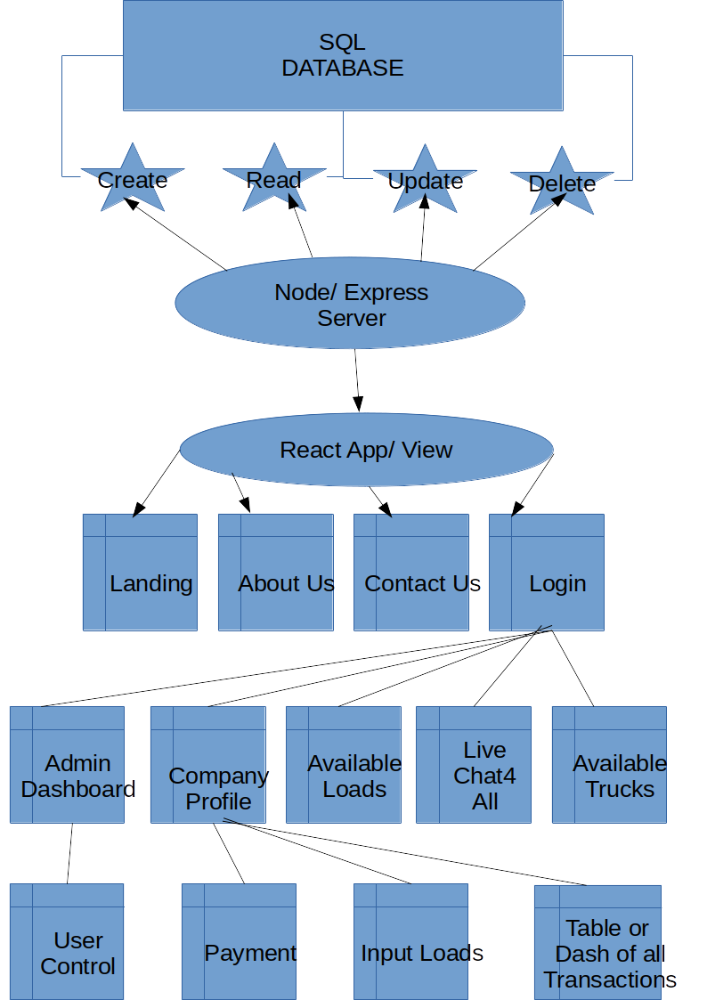

# GADZ

In order to follow all of the updates to this site, please visit [GADZWiki](https://github.com/dagreatcode/GADZ/wiki) and [Project Board](https://github.com/users/dagreatcode/projects/4)
___
Important Terminal Commands
```
npx create-react-app pwa-react-typescript --template cra-template-pwa-typescript
sudo pkill -f node
npm install -g sequelize-cli
npm install sequelize
sequelize init:config & sequelize init:models
ERD Entity relational diagram
sudo su postgres
```
https://github.com/marmelab/react-admin
https://pimylifeup.com/raspberry-pi-postgresql/
https://medium.com/@datatec.studio/remote-access-postgresql-in-raspberry-pi-2c275731207f
https://www.cockroachlabs.com/docs/stable/connect-to-the-database?filters=javascript&filters=sequelize&filters=linux
https://cockroachlabs.cloud/cluster/320f50d5-4817-4fcb-b79c-470fea12b02c/overview?cluster-type=serverless

http://globalassetdispatching.com/


## Description 
#### WireFrame Diagram

This is a quick Diagram of the Web App.



Your GitHub profile is an extremely important aspect of your public identity as a developer. A well-crafted one allows you to show off your work to other developers as well as potential employers. An important component of your GitHub profile—and one that many new developers often overlook—is the README.md file.

The quality of a README often differentiates a good project from a bad project. A good one takes advantage of the opportunity to explain and showcase what your application does, justify the technologies used, and even talk about some of the challenges you faced and features you hope to implement in the future. A good README helps you stand out among the large crowd of developers putting their work on GitHub.

There's no one right way to structure a good README. There is one very wrong way, however, and that is to not include a README at all or to create a very anemic one. This guide outlines a few best practices. As you progress in your career, you will develop your own ideas about what makes a good README.

At a minimum, your project README needs a title and a short description explaining the what, why, and how. What was your motivation? Why did you build this project? (Note: The answer is not "Because it was a homework assignment.") What problem does it solve? What did you learn? What makes your project stand out? If your project has a lot of features, consider adding a heading called "Features" and listing them here.

If you're new to Markdown, read the GitHub guide on [Mastering Markdown](https://guides.github.com/features/mastering-markdown/).

If you need an example of a good README, check out [the VSCode repository](https://github.com/microsoft/vscode).


## Table of Contents (Optional)

If your README is very long, add a table of contents to make it easy for users to find what they need.

* [Installation](#installation)
* [Usage](#usage)
* [Credits](#credits)
* [License](#license)


## Installation

What are the steps required to install your project? Provide a step-by-step description of how to get the development environment running.

## To Dos

Test Driven Error driven Data Driven...

    [X] Deploy and deploy often.
    [ ] Set test for front and backend of the project.
    [ ] Make db rules
    [ ] Create diagram.io
    [ ] Make github rules
    [ ] CI/CD with cypress
    [ ] Server and Routes Test by Mocha & Chai
    [ ] Setup Redux
    [ ] Wireframe
    [ ] Features
    [ ] Create Frontend trailed by Jest testing..
    [ ] Set up Redis for caching data.

## Usage 

If we are working on this project together, clone this project and ask for access. 

If you are working on this on your own, fork this project and continue to the next steps. 

Create a .env file in the root of the project
add  
```
DATABASE_URL="postgresql://<user>:<password>@<host>:<port><database>?sslmode=verify-full" 
```

Open terminal in code editor and run
```
npm install
npm install -D
npm run build && npm run start
```
Provide instructions and examples for use. Include screenshots as needed. 

## Tools

render.com
linode.com
AWS or AZURE

React Client view TypeScript ReactTypes

Bootstrap for CSS Frontend look.

Express RESTful API Routes/handlebars-Node Server Side TypeScript Sequelize CLI

planetscale.com SQL MySQL TimeScale n CockRoachDB Cloud PostgreSQL

Clerk.com User Auth JWT Bcrypt

Cloudanry.com Uploaded images and files

Redis caching

Redux State Management react-thunk plugin

CI/CD GitHub Action Cypress Testing

Mocha&Chi Server Testing

Jest Client testing

Axios Front n Back

React-Router-Dom Client nav routes to pages

lint prittier

SEO


## Credits

All credits go to GT Collage. Made from scratch MERN Stack Web App.


## License

MIT License

Copyright (c) 2023 Vincent Kendrick

Permission is hereby granted, free of charge, to any person obtaining a copy
of this software and associated documentation files (the "Software"), to deal
in the Software without restriction, including without limitation the rights
to use, copy, modify, merge, publish, distribute, sublicense, and/or sell
copies of the Software, and to permit persons to whom the Software is
furnished to do so, subject to the following conditions:

The above copyright notice and this permission notice shall be included in all
copies or substantial portions of the Software.

THE SOFTWARE IS PROVIDED "AS IS", WITHOUT WARRANTY OF ANY KIND, EXPRESS OR
IMPLIED, INCLUDING BUT NOT LIMITED TO THE WARRANTIES OF MERCHANTABILITY,
FITNESS FOR A PARTICULAR PURPOSE AND NONINFRINGEMENT. IN NO EVENT SHALL THE
AUTHORS OR COPYRIGHT HOLDERS BE LIABLE FOR ANY CLAIM, DAMAGES OR OTHER
LIABILITY, WHETHER IN AN ACTION OF CONTRACT, TORT OR OTHERWISE, ARISING FROM,
OUT OF OR IN CONNECTION WITH THE SOFTWARE OR THE USE OR OTHER DEALINGS IN THE
SOFTWARE. [https://choosealicense.com/](https://choosealicense.com/)


---

🏆 
## Badges


Badges aren't _necessary_, per se, but they demonstrate street cred. Badges let other developers know that you know what you're doing. Check out the badges hosted by [shields.io](https://shields.io/). You may not understand what they all represent now, but you will in time.


## Contributing
##### CHECK THE db FOLDER!!!

Add VS Code Extension [Database Client](https://database-client.com/#/home) by Weijan. Pick the PostgreSQL extension.

Also Add VS Code Extension REST Client API

If you created an application or package and would like other developers to contribute it, you will want to add guidelines for how to do so. The [Contributor Covenant](https://www.contributor-covenant.org/) is an industry standard, but you can always write your own.

## Tests

Run this command to test the frontend react CLIENT app with JEST. 
```
npm run testClient

```

Run this command to test the backend server files/routes/algorithms/plugins with Mocha & Chai. 
```
npm run test
```

---
© 2023. DaGreat Code LLC. All Rights Reserved.
